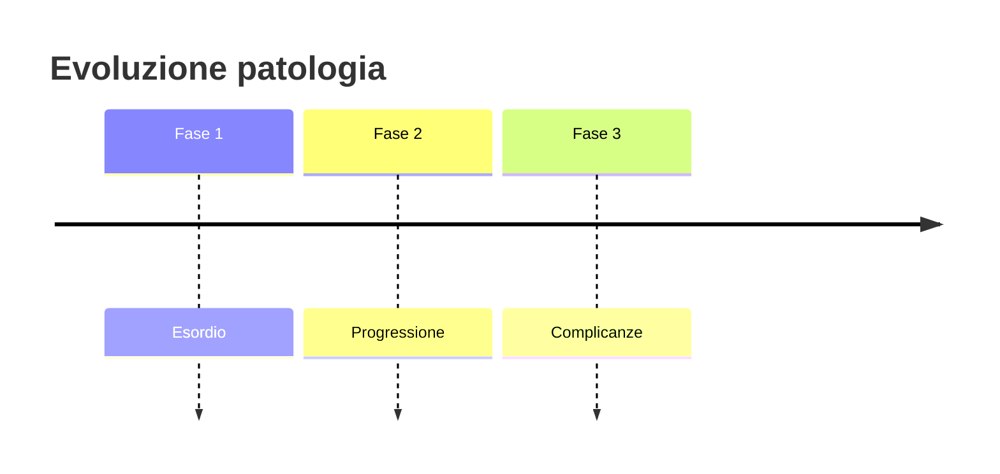

# Dettagli Tecnici Propaedeia

## Performance & Metriche

### Timing Medio

| Workflow | Tempo Totale | Fasi Incluse |
|----------|-------------|--------------|
| **Completo** (singola fonte, tutti i blocchi) | 45-60 min | 1-7 |
| **Completo** (multi-doc, tutti i blocchi) | 50-65 min | 0-7 (include Fase 0) |
| **Completo** (solo Blocco A) | 35-50 min | 0-5 (con Fase 0 se multi-doc) |
| **Essenziale** | 20-30 min | 1-2 (solo traccia + pagina) |

### Ottimizzazioni v4.7

| Fase | Tempo v4.6 | Tempo v4.7 | Note |
|------|-----------|-----------|------|
| **Fase 0** (NEW) | N/A | 3-5 min | Solo multi-doc |
| **Fase 1** | 5-10 min | 5-10 min | Invariato (singola) / +analisi (multi) |
| **Fase 2** | 15-25 min | 15-25 min | Invariato |
| **Totale multi-doc** | N/A | 50-65 min | Nuovo workflow |

### Ottimizzazioni v4.5

| Fase | Tempo v4.4 | Tempo v4.5 | Miglioramento |
|------|-----------|-----------|---------------|
| **Fase 2** (Pagina + Callout) | 18-28 min (separati) | 15-25 min | **-15%** (generazione combinata) |
| **Totale Blocco A** | 35-45 min | 30-40 min | **-13%** (workflow semplificato 7 fasi) |
| **Output chat** | ~2000 parole | ~100 parole | **-95%** (validazione CCI interna) |

### Ottimizzazioni v4.0

| Fase | Tempo v2.5 | Tempo v4.0 | Miglioramento |
|------|-----------|-----------|---------------|
| **Fase 3** (Callout) | 3-5 min | 1-2 min | **-60%** (str_replace vs lista) |
| **Fase 6** (Diagramma) | 3-5 min | 1-2 min | **-60%** (str_replace vs output chat) |
| **Fase 7** (Pubblicazione) | 3-5 min | 1 min | **-67%** (zero rigenerazione) |
| **Fase 8c** (Batch DB) | N/A | 3-5 min | **-80% API calls** (batch vs individuale) |

---

## API Calls & Cache

### API Calls per Fase

| Fase | Chiamate Tipiche | Note |
|------|------------------|------|
| Fase 0 (Multi-doc) | 0 | Solo analisi locale |
| Fase 1 (Traccia) | 0 | Solo generazione |
| Fase 2 (Pagina + Callout) | 2-3 | search + replace_content + update_properties |
| Fase 3 (Diagramma) | 1 | append_blocks |
| Fase 4 (Pitch) | 1 | update_properties |
| Fase 5 (Complessità) | 1 | update_properties |
| Fase 6 (Anki) | 0 | Solo generazione file |
| Fase 7 (Proprietà) | 12-20 | batch search (cached: -40%), batch create, update |

**Totale tipico**: 20-30 API calls per workflow completo

### Cache System

**Termini comuni** (cache hit rate 20-30%):
- Esami diagnostici: TC, RMN, Ecografia, Biopsia
- Farmaci: Corticosteroidi, Antibiotici, FANS
- Procedure: Intervento chirurgico, Drenaggio

**Funzionamento**:
```python
cache_termini = {
    "TC": "https://notion.so/TC-...",
    "Corticosteroidi": "https://notion.so/Corticosteroidi-...",
    "Biopsia": "https://notion.so/Biopsia-..."
}
```

**Benefici**:
- -40% chiamate duplicate in Fase 7
- Cache hit rate medio: 20-30%
- Tempo Fase 7 ridotto da ~8-12 min a ~3-5 min

---

## Retry Logic

### Pattern di retry

| Errore | Max Retry | Backoff | Note |
|--------|-----------|---------|------|
| **Timeout** | 3x | Esponenziale (1s, 2s, 4s) | API timeout |
| **Rate limit 429** | 3x | Esponenziale (1s, 2s, 4s) | Rate limiting |
| **Server 500+** | 2x | Esponenziale (1s, 2s) | Server errors |
| **Network** | 3x | Esponenziale (1s, 2s, 4s) | Connection errors |

### Rate Limiting

- **Delay minimo**: 350ms tra chiamate consecutive
- **Batch operations**: riduce chiamate totali
- **Cache**: evita chiamate duplicate

---

## Formato Relazioni Notion

### CRITICAL: Stringhe JSON per Relazioni

✅ **CORRETTO** (quando scrivi):
```json
{
  "Voci": "[\"https://notion.so/page1\", \"https://notion.so/page2\"]"
}
```

❌ **ERRATO**:
```json
{
  "Voci": ["https://notion.so/page1"]  // Array, non stringa JSON
}
```

```json
{
  "Voci": ["{{https://notion.so/page1}}"]  // Doppie graffe (solo in output Notion quando leggi)
}
```

### Esempio completo

**Scrittura** (update_properties):
```json
{
  "properties": {
    "Voci": "[\"https://notion.so/page1\", \"https://notion.so/page2\"]",
    "Argomenti correlati": "[\"https://notion.so/arg1\", \"https://notion.so/arg2\"]"
  }
}
```

**Lettura** (da Notion):
```json
{
  "Voci": [
    "{{https://notion.so/page1}}",
    "{{https://notion.so/page2}}"
  ]
}
```

---

## Formato Markdown Notion

### Indentazione

- **1 livello sotto H2**: 2 spazi iniziali
- **2 livelli sotto H3**: 4 spazi iniziali
- **NO TAB**: incompatibile con Notion import API

**Esempio**:
```markdown
## Sezione H2

  Testo indentato livello 1 (sotto H2)

### Sottosezione H3

    Testo indentato livello 2 (sotto H3)
```

### Callout

Formato con indentazione 2 spazi:

```markdown
  <callout icon="/icons/warning_red.svg" color="red_bg">
  <span color="red">Testo avvertenza</span>
  </callout>
```

**Tipi disponibili**:

| Tipo | Icon | Color | Uso |
|------|------|-------|-----|
| ⚠️ RED | `/icons/warning_red.svg` | `red_bg` | Warning clinici, controindicazioni, conflitti |
| 💡 BLUE | `/icons/lightbulb_blue.svg` | `blue_bg` | Concetti chiave, meccanismi |
| ⭐ GREEN | `/icons/star_green.svg` | `green_bg` | Perle, tips pratici |

### Toggle Headers

```markdown
## ▶ Titolo H2

### ▶ Titolo H3
```

**Nota**: Notion converte automaticamente `▶` in toggle interattivo

---

## MedGraph Diagrammi

### Palette Colori

- **Sfondo**: `#FFFFFF` (bianco)
- **Testo/linee**: `#000000` (nero)
- **Accento**: `#00E0CC` (cyan) - UN SOLO step critico, mai decorativo

### Vincoli Accessibilità

- Contrasto testo: ≥4.5:1 (WCAG AA)
- Contrasto connettori: ≥3:1
- Leggibile in scala di grigi (stampa-ready)

### Limiti

- **Nodi massimi**: 11
- **Livelli profondità**: ≤4

### Template Mermaid

**Flowchart decisionale**:

```mermaid
flowchart TD
    A[Inizio] --> B{Decisione}
    B -->|Sì| C[Step critico]
    B -->|No| D[Alternativa]

    style C fill:#00E0CC,stroke:#000,color:#000
```


**Timeline**:


---

## Pitch Formatting

### Formato Grassetto Markdown

**Property type**: `text` (non `rich_text`)

**Formato**:
```
Testo pitch normale. **Frase grassetto decisiva.** Resto del testo.
```

**Notion**: mantiene grassetto `**...**` nella property text

### Validazione

- **Lunghezza**: 170-200 parole (strict)
- **Grassetto**: UNA frase (max 2 righe)
- **Posizione**: preferibilmente centrale

---

## Scratchpad Schema

```python
workflow_state = {
    "fase_corrente": "2",
    "fasi_completate": ["0", "1"],

    "fonti": {
        "multi_doc": True,
        "documenti": [
            {
                "nome": "Sbobina Plastica",
                "categoria": "Chirurgia plastica",
                "coverage": {
                    "Eziologia": 1,
                    "Clinica": 2,
                    "Diagnosi": 1,
                    "Terapia": 3
                },
                "profondita": "Approfondita"
            },
            {
                "nome": "Dispensa Dermatologia",
                "categoria": "Dermatologia",
                "coverage": {
                    "Eziologia": 2,
                    "Clinica": 3,
                    "Diagnosi": 3,
                    "Terapia": 2
                },
                "profondita": "Standard"
            }
        ],
        "piano_integrazione": {
            "overlap": {
                "Eziologia": ["esposizione UV", "fattori genetici"],
                "Clinica": ["caratteristiche lesione", "evoluzione"],
                "Diagnosi": ["biopsia", "dermatoscopia"],
                "Terapia": ["escissione chirurgica"]
            },
            "complementare": {
                "Plastica": ["tecniche ricostruttive", "margini escissione", "innesti"],
                "Dermatologia": ["staging TNM", "follow-up dermatoscopico", "terapia topica"]
            },
            "conflitti": [
                {
                    "area": "Terapia",
                    "descrizione": "Margini escissione: Plastica 1-2cm vs Dermato 0.5-1cm",
                    "risoluzione": "Usa range chirurgico (1-2cm)"
                }
            ],
            "pesi_per_h2": {
                "Eziologia e fattori di rischio": {
                    "Plastica": 30,
                    "Dermatologia": 70
                },
                "Quadro clinico": {
                    "Plastica": 40,
                    "Dermatologia": 60
                },
                "Diagnosi": {
                    "Plastica": 25,
                    "Dermatologia": 75
                },
                "Terapia chirurgica": {
                    "Plastica": 75,
                    "Dermatologia": 25
                }
            }
        }
    },

    "outputs": {
        "titolo_argomento": "Melanoma cutaneo",
        "traccia_h2": ["Eziologia", "Clinica", "Diagnosi", "Terapia", "Follow-up"],
        "notion_page_url": "https://notion.so/Melanoma-...",
        "pitch": "Testo pitch...",
        "anki_file": "anki_deck.txt",
        "voci_estratte": {
            "Eziologia": ["UV", "BRAF", "nevi"],
            "Clinica": ["ABCDE", "Breslow"],
            "Diagnosi": ["dermatoscopia", "biopsia", "linfonodo sentinella"],
            "Terapia": ["margini escissione", "innesto", "immunoterapia"]
        }
    },

    "validation": {
        "cci_check": {
            "frasi_totali": 145,
            "frasi_lunghe": 5,
            "percentuale": 3.8,
            "status": "PASS"
        },
        "prerequisiti": []
    },

    "performance": {
        "api_calls": 32,
        "cached": 4,
        "retry": 0,
        "tempo_totale_min": 58
    }
}
```

---

## Database Schema SQLite

### Voci Table

```sql
CREATE TABLE Voci (
    id TEXT PRIMARY KEY,
    Name TEXT NOT NULL,
    Categoria TEXT,  -- JSON array: ["Eziologia"], ["Clinica"], ["Diagnosi"], ["Terapia"]
    Argomento TEXT,  -- JSON array URLs: ["https://notion.so/..."]
    Note TEXT,
    Gruppo TEXT,     -- Self-relation URL
    Sottogruppo TEXT -- Self-relation URL
);
```

### Argomenti Table

```sql
CREATE TABLE Argomenti (
    id TEXT PRIMARY KEY,
    Nome TEXT NOT NULL,
    Pitch TEXT,
    Voci TEXT,  -- JSON array URLs: ["https://notion.so/..."]
    Complessità TEXT,  -- "Semplice" | "Media" | "Complessa"
    Tempo_studio_stimato INTEGER,  -- minuti
    Tipo TEXT,
    Argomento_primario INTEGER,  -- 0 | 1 (boolean)
    Status_argomento TEXT,
    Argomenti_correlati TEXT  -- JSON array URLs (self-relation)
);
```

---

**Ultimo aggiornamento**: v4.7 (2025-10-20)
**Piattaforma**: Claude Web, Claude Code
**Dipendenze**: API Notion (custom integration), Mermaid.js
